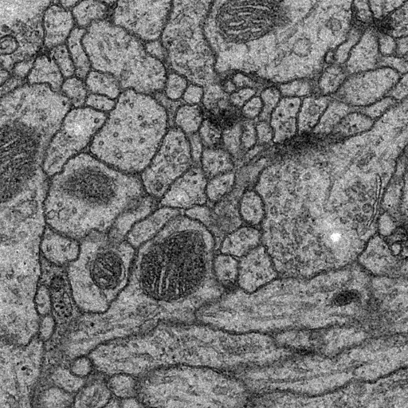
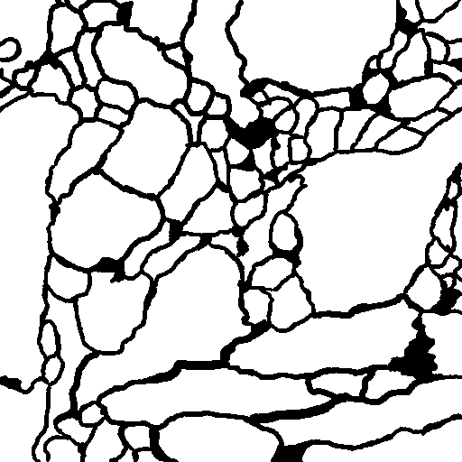
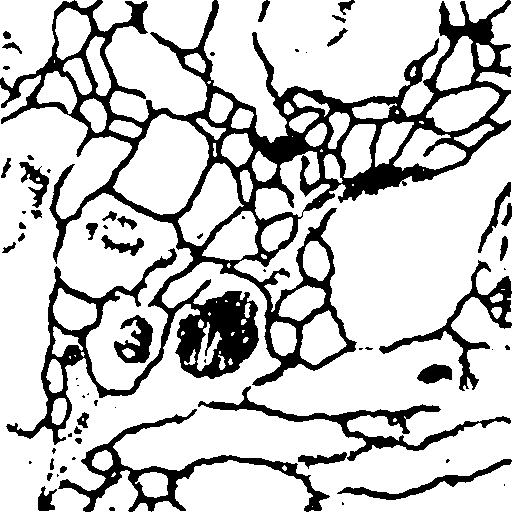

# UNet torch
Sementic segmentation (이미지 픽셀분할)분야의 vanilla UNet(2015) architectures를 pytorch로 구현


**본 repository는 @hanyoseob 님의 `youtube-cnn-002-pytorch-unet` [github](https://github.com/hanyoseob/youtube-cnn-002-pytorch-unet)을 바탕으로 공부하여 약간의 코드 수정, 주석 및 코드 리펙토링을 가미하였음을 밝힙니다.**

<center></center>

| Original | G.T | Inference (epoch 10) |
|----------|-----| ----------|
|  |  |   |

## 사용한 데이터셋
* isbi 2012 EM (Electron Microscopy) dataset
* 전자현미경으로 촬영한 세포의 membrain segmentation
* 본 repository의 dataset/ dir에 저장해둠
* 공식 데이터 다운로드(github) : https://github.com/alexklibisz/isbi-2012

## 구성
* `학습 및 테스트.ipynb` : 만들어진 *.py를 바탕으로 train, test(eval)을 진행
  * train, evaluation proc included 
  * single or multi gpu selection included
  * visualization included
  * jupyter tensorboard included
* `train.py` : command line based train, tes(eval)을 진행

## 실행 방법
### dataset 준비
해당 command 실행 시, datasets/ 아래에 train, test, val dir와 npy데이터셋 생성
  ```bash
  python data_read.py
  ```
### training / evaluation
두 가지 방식의 실행 가능
1. jupyter 실행 : 개인 jupyter환경 혹은 colab에서 `학습 및 테스트.ipynb` 실행
2. command 실행
   ```bash
   python "train.py" \
         --lr 1e-2 --batch_size 2 --num_epoch 300 \
         --data_dir "datasets" \
         --ckpt_dir "checkpoint" \ # ckpt dir 생성
         --log_dir "log" \         # log dir 생성
         --result_dir "result" \   # 결과 dir 생성
         --mode "test" \           # train or test
         --train_continue "off"    # on: ckpt를 이어 학습, off: 새로 학습
   ```

# Reference
* [UNET original paper](https://arxiv.org/pdf/1505.04597.pdf)
* [한요섭 박사님 UNet github](https://github.com/hanyoseob/youtube-cnn-002-pytorch-unet)
